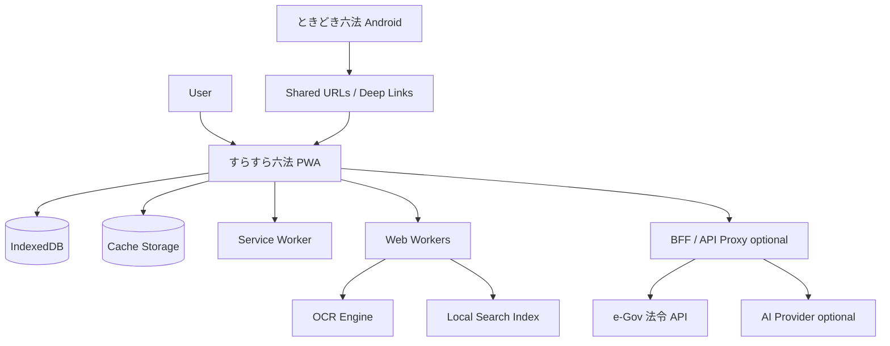

# すらすら六法 Design Doc

Status: Draft
Last updated: 2026-07-05
Repository: `SlashNephy/surasura-roppou`

Related docs:

- [Task index](tasks.md)
- [ADR index](adr/README.md)

## 1. Summary

**すらすら六法** は、e-Gov 法令データをもとに、法令を読みやすく閲覧し、学習中に出会った条文をすぐ確認・保存・復習できる Web/PWA アプリである。

既存の Android アプリ **ときどき六法** は、通知・バックグラウンド処理・ネイティブ体験を担うコンパニオンアプリとして残す。すらすら六法は、レスポンシブ Web/PWA として、PC・タブレット・スマートフォンから使える「読みやすい法令ビューア + 学習支援ツール」を目指す。

特に重視する体験は次の 3 つ。

1. **すぐ開ける**: `国賠法1条`、`民709`、`行政手続法14条` のような参照から該当条文へジャンプする。
2. **すらすら読める**: 条・項・号の構造化、原文/読みやすい表示の切替、漢数字→算用数字変換、目次、検索、定義語表示で読む負担を減らす。
3. **こつこつ覚えられる**: ブックマーク、メモ、OCR 取り込み、クイズ、復習カードで、出会った条文を学習資産に変える。

## 2. Background

法令学習や実務調査では、参考書・問題集・講義資料・Web記事・メモの中に、唐突に条文参照が登場する。

例:

- `国家賠償法 1条`
- `国賠法1条`
- `民法709条`
- `行政事件訴訟法3条`
- `地方自治法242条の2`
- `憲法21条1項`

このとき、ユーザーは法令名で検索し、目次から条文を探し、該当箇所を読み、必要ならメモや復習に残す。この一連の流れは頻繁に発生するが、既存の法令検索サービスでは「見つける」「読みやすくする」「覚える」が一体化していない。

すらすら六法では、法令ビューアを中心に、OCR・参照パーサー・ブックマーク・復習カードを統合し、学習中の条文確認を高速化する。

## 3. Product Positioning

### 3.1 ときどき六法との関係

| アプリ       | 主な役割                         | 得意領域                                                  |
| ------------ | -------------------------------- | --------------------------------------------------------- |
| ときどき六法 | 条文通知・Android ネイティブ体験 | WorkManager、ローカル通知、ネイティブ通知、オフライン通知 |
| すらすら六法 | 法令閲覧・検索・OCR・学習        | Web/PWA、PC/スマホ横断、条文ジャンプ、復習、クイズ        |

通知機能は Android ネイティブの強みが大きいため、PWA では無理に完全再現しない。Web 側では「今日の復習」「最近見た条文」「OCR から復習化」といったアプリ内学習導線を主軸にする。

将来的には、両者を Deep Link / Universal Link / Android App Links / Export & Import / アカウント同期などで連携する。

### 3.2 Name Concept

**すらすら六法** は、既存の **ときどき六法** と響きを揃えつつ、読みにくい法令を「すらすら読める」体験を表す。

候補コピー:

- 撮って、開いて、すらすら読める。
- 条文参照を、すぐ開く。
- 法令を、読みやすく。覚えやすく。

## 4. Goals / Non-Goals

### 4.1 Goals

- e-Gov 由来の法令データを読みやすく閲覧できる。
- レスポンシブ Web アプリとして、スマートフォン・タブレット・PC で自然に使える。
- PWA としてインストールでき、保存済み法令・ブックマーク・復習カードをオフラインで利用できる。
- 法令名、略称、条文番号、本文から検索できる。
- `国賠法1条`、`民709` のような学習者向け表記から該当条文へジャンプできる。
- カメラ・画像・クリップボード・手入力から条文参照を検出できる。
- 法令・条文・項・号単位でブックマークできる。
- 条文をクイズ・復習カード化できる。
- 原文を保持しつつ、漢数字→算用数字変換などの読みやすい表示を提供する。
- 法的正確性のため、常に出典・法令名・条文番号・取得時点/基準日を明示する。

### 4.2 Non-Goals

- PWA 単体で Android ネイティブと同等の完全ローカル定期通知を実現すること。
- 法的助言、違法/合法の断定、個別事案への結論提示。
- すべての法令データを初回起動時に端末へ保存すること。
- OCR で読み取った参考書・問題集の画像をクラウドに無断保存すること。
- 既存の e-Gov 法令検索を完全に置き換えること。

## 5. Target Users

### 5.1 Primary Persona: 資格学習者

例: 行政書士、宅建、司法書士、予備試験、法学部生。

Needs:

- 問題集や講義資料に出てきた条文をすぐ開きたい。
- よく出る条文を保存したい。
- 条文を読みやすくしたい。
- 間違えた条文を復習したい。
- 学習年度の基準日で条文を確認したい。

### 5.2 Secondary Persona: 実務調査ユーザー

例: エンジニア、バックオフィス、個人情報保護・労務・契約まわりを調べる人。

Needs:

- よく使う法令・条文をブックマークしたい。
- 改正や施行時点を意識したい。
- オフラインでも確認したい。
- 条文コピーや引用を楽にしたい。

### 5.3 Tertiary Persona: ときどき六法ユーザー

Needs:

- 通知で出会った条文を Web で詳しく読みたい。
- Android アプリのコレクションを Web 側でも見たい。
- Web で作った復習カードを Android 側通知と連携したい。

## 6. Core User Journeys

### 6.1 参照ジャンプ

```text
参考書に「国賠法1条」が出てくる
  ↓
検索バーに「国賠法1条」と入力
  ↓
候補: 国家賠償法 第1条
  ↓
該当条文を表示
  ↓
ブックマーク or 復習カード化
```

### 6.2 OCR から条文ジャンプ

```text
問題集のページを撮影
  ↓
OCR でテキスト化
  ↓
条文参照を抽出
  ↓
候補一覧を表示
  ↓
該当条文へジャンプ
  ↓
まとめて復習リストに追加
```

### 6.3 すらすら閲覧

```text
法令を開く
  ↓
目次から章/節/条へ移動
  ↓
原文表示と読みやすい表示を切替
  ↓
定義語・参照条文をプレビュー
  ↓
必要な条文を保存
```

### 6.4 復習

```text
今日の復習を開く
  ↓
穴埋め・正誤・条文番号クイズを解く
  ↓
根拠条文を確認
  ↓
正答履歴を保存
  ↓
次回復習日を更新
```

### 6.5 ときどき六法連携

```text
Android 通知で条文に出会う
  ↓
通知タップで Android アプリを開く
  ↓
「Webで詳しく読む」からすらすら六法へ
  ↓
PC/タブレットでメモ・クイズ化
```

## 7. Functional Requirements

### 7.1 Law Viewer

- 法令名・法令番号・法令種別・施行状態を表示する。
- 本文を条・項・号・別表などの構造単位で表示する。
- 左ペイン/ボトムシートで目次を表示する。
- 条番号ジャンプを提供する。
- 条文ごとの permalink を持つ。
- 原文表示と読みやすい表示を切り替えられる。
- 条・項・号を折りたためる。
- 別表・様式・附則を本文とは別導線で読めるようにする。
- 出典、取得日時、表示基準日を表示する。

### 7.2 Search

- 法令名検索。
- 略称検索。
- 法令番号検索。
- 開いている法令内の本文検索。
- 保存済み法令の横断検索。
- 条文参照クイックジャンプ。
- 将来的には BFF 側検索インデックスによる全法令横断検索。

### 7.3 Bookmarks / Collections

- 法令全体、条、項、号単位で保存できる。
- タグ、メモ、色、フォルダを付けられる。
- 最近開いた条文を自動保存する。
- ブックマークした条文から復習カードを作成できる。
- JSON 形式で export/import できる。

### 7.4 Offline

- アプリシェルを Service Worker でキャッシュする。
- 保存済み法令を IndexedDB に保存する。
- ブックマーク、メモ、復習カード、学習履歴を IndexedDB に保存する。
- オフライン時は保存済み法令・ローカル検索・復習を利用できる。
- ストレージ使用量と最終同期日時を表示する。
- 「この法令をオフライン保存」「このコレクションを保存」を提供する。

### 7.5 Readability Transformations

- 全角かっこを半角化できる。
- 漢数字を算用数字へ変換できる。
- 条・項・号番号の視認性を上げる。
- 長い条文を段落・リストとして読みやすく整える。
- 原文と加工表示を常に切り替えられる。
- コピー時に原文/加工表示/Markdown/出典付きコピーを選べる。

重要: 加工表示は表示レイヤーで行い、原文データは必ず保持する。

### 7.6 Law Reference Resolver

手入力・OCR・クリップボードから、法令参照を検出して条文に解決する。

MVP で対応したい表記:

```text
国家賠償法 1条
国家賠償法第1条
国賠法1条
国賠1
民法709条
民709
行政手続法14条
行手法14条
行政事件訴訟法3条
行訴法3条
地方自治法242条の2
憲法21条1項
```

発展対応:

```text
第1条第1項第1号
1条1項1号
第十二条の二
一条二項三号
憲21Ⅰ
同法1条
前条
次条
前項
本文
ただし書
別表第一
```

Resolver は候補と confidence score を返す。OCR 由来の場合は誤認識を前提に、必ず候補確認 UI を挟む。

### 7.7 OCR Intake

入力手段:

- カメラ撮影。
- 画像アップロード。
- クリップボード画像。
- テキスト貼り付け。

処理:

1. 画像の前処理。
2. OCR。
3. テキスト正規化。
4. 法令参照抽出。
5. 候補解決。
6. 条文ジャンプ。
7. 復習カード化。

MVP ではクライアントサイド OCR を優先する。サーバー OCR は、精度が必要な場合にユーザー明示同意の上でオプション化する。

### 7.8 Study Features

カード種別:

- 穴埋めクイズ。
- 正誤クイズ。
- 条文番号当て。
- 法令名当て。
- 定義語クイズ。
- 要件・効果分解。
- 似ている条文の比較。

復習状態:

```text
未学習
確認済み
復習中
苦手
定着
試験直前に確認
```

復習スケジューリング:

- 初期実装は簡易 interval ベース。
- `again / hard / good / easy` のような回答評価を持つ。
- 将来的に SM-2 系アルゴリズムや FSRS の導入を検討する。

### 7.9 Study Mode for 行政書士

行政書士学習向けのプリセットを用意する。

- 憲法。
- 民法。
- 行政法。
- 商法/会社法。
- 基礎法学。
- 行政手続法、行政不服審査法、行政事件訴訟法、国家賠償法、地方自治法などのパック。

機能:

- 学習年度の基準日設定。
- 科目別コレクション。
- 科目別クイズ。
- よく出る条文リスト。
- OCR で検出した条文の科目分類。

### 7.10 Native/Web Integration

通知機能は Android ネイティブを主軸にする。

連携候補:

- Web で開ける安定 URL を定義する。
- Android App Links で `https://surasura-roppou.example/laws/...` を Android 側に開かせる。
- Android アプリから Web 版の条文 URL を開く。
- Web 版から Android アプリ用 custom scheme を呼ぶ。
- コレクション/ブックマーク/復習カードを JSON export/import する。
- 将来的にアカウント同期を導入する。

## 8. Non-Functional Requirements

### 8.1 Performance

- 初回表示はアプリシェルを軽くする。
- OCR・検索インデックス生成・大きな法令の正規化は Web Worker で行う。
- 法令本文は必要な単位で遅延ロードする。
- 大きな法令では仮想リスト化を検討する。
- 保存済み法令検索は 500ms 以内の応答を目標にする。

### 8.2 Accessibility

- キーボード操作可能にする。
- 条文番号、本文、注釈、ボタンのセマンティクスを保つ。
- 文字サイズ・行間・テーマを調整可能にする。
- ダークモードに対応する。
- スクリーンリーダーで条・項・号の構造が分かるようにする。

### 8.3 Privacy

- OCR 画像はデフォルトで端末内処理し、保存しない。
- サーバー OCR を使う場合は明示的な同意を取る。
- 学習履歴・ブックマーク・メモはローカル優先。
- 同期機能を入れる場合は、ユーザーが同期対象を選べるようにする。

### 8.4 Legal/Safety

- 法令本文の出典を明示する。
- 表示時点/基準日を明示する。
- 原文と加工表示を区別する。
- AI 機能を導入する場合、法的助言ではなく学習補助として扱う。
- AI 出力には根拠条文へのリンクを必ず付ける。

## 9. Architecture

### 9.1 High-Level Architecture



### 9.2 Client Responsibilities

- UI rendering。
- PWA installability。
- App shell caching。
- Local data storage。
- Saved law offline viewer。
- Bookmarks and study cards。
- Reference extraction and resolution。
- OCR where feasible。
- Local search for saved laws。

### 9.3 BFF Responsibilities

MVP では BFF は optional。ただし本格運用では BFF を推奨する。

BFF が担う候補:

- e-Gov API の proxy。
- API response の正規化。
- CORS/Cache-Control の安定化。
- 法令メタデータのキャッシュ。
- 法令略称辞書の配信。
- 全法令検索インデックス。
- AI API key の秘匿。
- Web Push 配信。
- ときどき六法との同期 API。

### 9.4 Storage Strategy

| Data              | Storage                   | Notes                                    |
| ----------------- | ------------------------- | ---------------------------------------- |
| App shell         | Cache Storage             | HTML/CSS/JS/icon                         |
| API responses     | Cache Storage + IndexedDB | Raw response と normalized data を分ける |
| Law metadata      | IndexedDB                 | lawId, title, aliases, versions          |
| Law nodes         | IndexedDB                 | Article/Paragraph/Item 単位              |
| Search index      | IndexedDB                 | 保存済み法令対象                         |
| Bookmarks         | IndexedDB                 | lawId + path                             |
| Notes/annotations | IndexedDB                 | articlePath + text anchor                |
| Study cards       | IndexedDB                 | dueAt, interval, history                 |
| User settings     | IndexedDB/localStorage    | 大きな設定は IndexedDB                   |
| OCR images        | Memory / temporary Blob   | デフォルト保存しない                     |

### 9.5 Caching Strategy

| Request                | Strategy                               |
| ---------------------- | -------------------------------------- |
| App shell              | precache                               |
| Static assets          | cache first                            |
| Law metadata           | stale-while-revalidate                 |
| Opened law data        | network first, fallback to cache       |
| Offline saved law data | cache/IndexedDB first                  |
| AI requests            | network only                           |
| OCR language model     | cache first after user opt-in/download |

## 10. Data Model Draft

```ts
export type Law = {
  lawId: string;
  title: string;
  lawNumber?: string;
  lawType?: string;
  aliases: string[];
  source: "egov";
  updatedAt?: string;
};

export type LawRevision = {
  lawId: string;
  revisionId: string;
  asOf?: string;
  effectiveDate?: string;
  fetchedAt: string;
  sourceUrl?: string;
};

export type LawNodeType =
  | "Part"
  | "Chapter"
  | "Section"
  | "Subsection"
  | "Division"
  | "Article"
  | "Paragraph"
  | "Item"
  | "Subitem"
  | "SupplementaryProvision"
  | "AppdxTable"
  | "AppdxStyle";

export type LawNode = {
  id: string;
  lawId: string;
  revisionId: string;
  type: LawNodeType;
  path: string;
  number?: string;
  title?: string;
  rawText: string;
  normalizedText?: string;
  children: string[];
  parentId?: string;
};

export type Bookmark = {
  id: string;
  target: {
    lawId: string;
    revisionId?: string;
    path?: string;
  };
  title: string;
  note?: string;
  tags: string[];
  color?: string;
  createdAt: string;
  updatedAt: string;
};

export type Annotation = {
  id: string;
  lawId: string;
  revisionId?: string;
  path: string;
  targetText?: string;
  prefixText?: string;
  suffixText?: string;
  note: string;
  tags: string[];
  createdAt: string;
  updatedAt: string;
};

export type StudyCardType =
  | "fill_blank"
  | "true_false"
  | "article_number"
  | "law_name"
  | "definition"
  | "requirements_effects"
  | "compare";

export type StudyCard = {
  id: string;
  source: "manual" | "ocr" | "bookmark" | "auto";
  lawId: string;
  revisionId?: string;
  path: string;
  type: StudyCardType;
  question: string;
  answer: string;
  explanation?: string;
  tags: string[];
  dueAt: string;
  intervalDays: number;
  ease: number;
  mistakes: number;
  lastReviewedAt?: string;
  createdAt: string;
  updatedAt: string;
};

export type DetectedLawReference = {
  id: string;
  rawText: string;
  normalizedText: string;
  lawNameCandidate?: string;
  lawAlias?: string;
  article?: string;
  paragraph?: string;
  item?: string;
  confidence: number;
  source: {
    type: "manual" | "ocr" | "clipboard";
    imageId?: string;
    boundingBox?: {
      x: number;
      y: number;
      width: number;
      height: number;
    };
  };
  candidates: LawReferenceCandidate[];
};

export type LawReferenceCandidate = {
  lawId: string;
  lawTitle: string;
  revisionId?: string;
  path?: string;
  score: number;
  reason: string[];
};
```

## 11. Law Reference Resolver Design

### 11.1 Pipeline

```text
Input text
  ↓
Unicode normalization
  - NFKC
  - 全角/半角統一
  - 空白正規化
  - OCR誤認識補正
  ↓
Law alias matching
  ↓
Article/paragraph/item parsing
  ↓
Kanji/roman numeral conversion
  ↓
Candidate generation
  ↓
Scoring
  ↓
Confirmation UI
```

### 11.2 Alias Dictionary

初期辞書例:

| Alias         | Law                        |
| ------------- | -------------------------- |
| 憲法          | 日本国憲法                 |
| 民法 / 民     | 民法                       |
| 商法 / 商     | 商法                       |
| 刑法 / 刑     | 刑法                       |
| 民訴          | 民事訴訟法                 |
| 刑訴          | 刑事訴訟法                 |
| 行手法        | 行政手続法                 |
| 行審法        | 行政不服審査法             |
| 行訴法        | 行政事件訴訟法             |
| 国賠法 / 国賠 | 国家賠償法                 |
| 地自法        | 地方自治法                 |
| 個情法        | 個人情報の保護に関する法律 |
| 会社法        | 会社法                     |

辞書はアプリ内固定 + BFF 配信で更新可能にする。

### 11.3 Confidence Scoring

Scoring signals:

- 法令名の完全一致。
- 略称の一致。
- 条番号が存在する。
- 項/号番号が存在する。
- 入力文字列の編集距離。
- OCR confidence。
- 最近開いた法令/学習モードの科目。
- ユーザーのブックマーク/履歴。

### 11.4 Ambiguity Handling

- 候補が 1 件かつ score が閾値以上なら直接ジャンプ。
- 候補が複数ある場合は候補リストを表示。
- OCR 由来の場合は原則として候補確認を表示。
- `同法`、`前条`、`同項` は周辺文脈がない場合は未解決候補として表示する。

## 12. Readability Transformation Design

### 12.1 Principles

- 原文を絶対に破壊しない。
- 表示レイヤーで変換する。
- 構造化フィールドを優先して変換する。
- 本文中の無差別置換は避ける。
- コピー時に原文/加工済みを選択できる。

### 12.2 Conversion Examples

| Raw                    | Display           |
| ---------------------- | ----------------- |
| 第一条                 | 第1条             |
| 第十二条の二           | 第12条の2         |
| 第三項                 | 第3項             |
| 第一号                 | 第1号             |
| 別表第一               | 別表1             |
| 令和六年四月一日       | 令和6年4月1日     |
| 平成五年法律第八十八号 | 平成5年法律第88号 |

### 12.3 Avoided Conversions

- 一般。
- 一部。
- 同一。
- 統一。
- 一時。
- 第一義的。
- 固有名詞。
- 原文性が重要な引用部分。

## 13. OCR Design

### 13.1 Client-Side First

MVP では、画像をサーバーに送らずに、ブラウザ内 OCR を優先する。

Reasons:

- 学習資料や問題集の画像はプライバシー/著作権上センシティブ。
- オフラインに近い体験が作れる。
- サーバーコストを抑えられる。

Trade-offs:

- 日本語 OCR モデルは大きい。
- 初回ロードが重い。
- 縦書き・ルビ・影・斜め撮影に弱い可能性がある。
- モバイルでは処理時間とバッテリー消費に注意。

### 13.2 OCR UI

- 撮影前に「画像は端末内で処理されます」と表示する。
- 撮影後、画像のトリミング/回転/明るさ調整を提供する。
- OCR 結果全文ではなく、検出した条文参照を主表示する。
- 検出箇所を画像上にハイライトする。
- 候補ごとに `開く`、`復習に追加`、`無視` を選べる。

## 14. Study Design

### 14.1 Card Generation

カード生成元:

- ユーザーが手動作成。
- ブックマークから作成。
- OCR で検出した条文から作成。
- 条文本文から自動作成。
- AI による補助生成。

自動生成対象:

- 重要語句。
- 定義語。
- 数字/期間。
- 要件語。
- 効果語。
- `できる` / `しなければならない` / `みなす` / `推定する`。

### 14.2 Quiz Examples

#### 穴埋め

```text
国又は公共団体の（　　　）の行使に当る公務員が...
```

#### 正誤

```text
国家賠償法1条の責任成立には、公務員の故意又は過失を要しない。
○ / ×
```

#### 条文番号当て

```text
「公権力の行使に当る公務員が...」はどの条文か？
A. 国家賠償法1条
B. 国家賠償法2条
C. 行政事件訴訟法3条
D. 行政手続法14条
```

#### 定義語

```text
Q. 行政手続法における「申請」とは？
```

### 14.3 Answer Review

回答後は必ず根拠条文を表示する。

```text
答え: ×
根拠: 国家賠償法 第1条
表示基準日: 2026-04-01
```

## 15. UI/UX Draft

### 15.1 Information Architecture

```text
Home
  - Search / Quick Jump
  - 最近開いた条文
  - 今日の復習
  - ブックマーク
  - オフライン保存済み

Law Viewer
  - 目次
  - 本文
  - 検索
  - ブックマーク
  - メモ
  - 表示設定

Scan
  - Camera
  - Image upload
  - Clipboard
  - Detected references

Study
  - 今日の復習
  - 条文カード
  - 苦手条文
  - 科目別

Settings
  - 表示設定
  - オフライン保存
  - 学習年度
  - Export/Import
  - Native integration
```

### 15.2 Desktop Layout

```text
┌────────────┬──────────────────────┬──────────────┐
│ 目次        │ 本文                  │ メモ/定義/保存 │
│ 検索結果    │ 第1条 ...             │ 復習カード      │
│ ブックマーク │ 第2条 ...             │ 関連条文        │
└────────────┴──────────────────────┴──────────────┘
```

### 15.3 Mobile Layout

```text
┌────────────────────┐
│ 検索 / 法令名        │
├────────────────────┤
│ 本文                │
│                    │
├────────────────────┤
│ 目次 検索 撮る 保存 復習 │
└────────────────────┘
```

### 15.4 Home Quick Actions

- `国賠1` を入力。
- カメラで撮る。
- 画像を読み込む。
- 今日の復習を始める。
- 最近開いた条文へ戻る。

## 16. Routing / URL Design

Stable URLs are the contract between Web, Android, bookmarks, and shared links.

Draft:

```text
/                              Home
/search?q=民法709               Search
/laws/:lawId                    Law top
/laws/:lawId/:revisionId        Specific revision
/laws/:lawId/articles/:article  Article
/laws/:lawId/articles/:article?paragraph=1&item=1
/scan                           OCR intake
/study                          Study home
/study/cards/:cardId            Card
/bookmarks                      Bookmarks
/settings                       Settings
```

Examples:

```text
/laws/129AC0000000089/articles/709
/laws/325AC0000000125/articles/1
/search?q=国賠法1条
```

Canonical URL の法令識別子には e-Gov の `lawId` を使う。
法令番号、正式名称、略称は検索や参照解決の入力として扱い、URL へ遷移するときに `lawId` へ解決する。
改正時点を固定する URL が必要な場合は、e-Gov の `law_revision_id` を `:revisionId` として扱う。
この判断は [ADR 2026-07-05: e-Gov Law ID を canonical URL に使う](adr/2026-07-05-egov-law-id-canonical-url.md) に記録する。

## 17. Tech Stack

### 17.1 Frontend

Adopted baseline:

- TypeScript。
- React。
- Vite。
- TanStack Router。
- Tailwind CSS。
- radix-ui / shadcn/ui style の共通 UI。
- lucide-react。

Future candidates:

- Zustand / Jotai for client state。
- Dexie.js for IndexedDB。
- Workbox or framework-native PWA plugin。
- MiniSearch / FlexSearch for local search。
- Web Workers for OCR/search/indexing。

### 17.2 BFF

Candidates:

- Hono + Cloudflare Workers。
- Node.js + Fastify。
- Next.js Route Handlers。

BFF は MVP では optional だが、AI・全法令検索・API proxy・sync を入れるなら早めに導入する。

### 17.3 Testing

- Vitest for unit tests。
- Playwright for E2E/PWA/offline tests。
- Testing Library for UI tests。
- Fixture-based tests for law reference resolver and number normalizer。
- Synthetic OCR fixture images for OCR pipeline.

## 18. Milestones

### M0: Repository Foundation

- Project scaffold: done。
- Lint/format/test: done。
- Basic CI: done。
- PWA manifest skeleton: done。
- Domain model and article path foundation: done。
- e-Gov data repository foundation: done。
- Design doc / task index / ADR directory: in progress。

### M1: Viewer MVP

- 法令検索。
- e-Gov API 取得。
- 法令本文表示。
- 条文目次。
- 条番号ジャンプ。
- 原文表示。
- レスポンシブ UI。

### M2: Offline + Bookmarks

- Service Worker。
- IndexedDB schema。
- 法令/条文ブックマーク。
- 最近開いた条文。
- 保存済み法令のオフライン閲覧。
- ローカル検索。

### M3: Readability

- 漢数字→算用数字変換。
- 全角かっこ半角化。
- 原文/読みやすい表示切替。
- コピー形式選択。
- 定義語抽出。
- 同一法令内リンク化。

### M4: Quick Jump / Resolver

- 略称辞書。
- `国賠1` / `民709` 対応。
- 条・項・号 parsing。
- 候補表示 UI。
- Resolver test fixtures。

### M5: OCR Intake

- カメラ撮影。
- 画像アップロード。
- クライアント OCR。
- 条文参照抽出。
- 画像上のハイライト。
- 条文ジャンプ。

### M6: Study

- 復習カード。
- 穴埋めクイズ。
- 正誤クイズ。
- 条文番号当て。
- 今日の復習。
- 苦手条文管理。

### M7: Native/Web Integration

- Shared URL contract。
- Android から Web へ開く。
- Export/import。
- Android App Links or custom scheme。
- 将来的な同期設計。

### M8: Advanced Features

- 改正履歴。
- 時点指定。
- 新旧差分。
- AI 学習補助。
- サーバー検索インデックス。
- アカウント同期。

## 19. Risks and Mitigations

| Risk                      | Impact                    | Mitigation                                                  |
| ------------------------- | ------------------------- | ----------------------------------------------------------- |
| OCR 精度が低い            | 条文ジャンプ体験が壊れる  | 候補確認 UI、手入力 fallback、画像前処理                    |
| 日本語 OCR モデルが重い   | 初回体験が重い            | OCR は lazy load、必要時 download、Web Worker               |
| PWA storage eviction      | オフライン保存が消える    | 保存状態表示、export、再同期、StorageManager persisted 検討 |
| e-Gov API 仕様変更        | 取得処理が壊れる          | BFF で吸収、schema validation、integration test             |
| 加工表示の誤変換          | 法的正確性リスク          | 原文保持、変換対象制限、テスト、原文コピーを既定にする      |
| AI 出力の誤り             | 学習上の誤解              | 根拠条文必須、AI は補助、ユーザー確認                       |
| 通知を PWA で再現しすぎる | ブラウザ差で不安定        | 通知は Android 側に委譲、Web はアプリ内復習中心             |
| スキャン画像の扱い        | プライバシー/著作権リスク | ローカル処理、デフォルト保存なし、同意制                    |

## 20. Open Questions

- Framework は Vite + React で始めるか、Next.js/TanStack Start にするか。
- e-Gov API は MVP で直接 fetch するか、最初から BFF を置くか。
- 行政書士向けプリセットの初期法令セットをどこまで含めるか。
- OCR は Tesseract.js で十分か、サーバー OCR を早期導入するか。
- 学習カード生成に AI を使うか、まずは deterministic rules で作るか。
- ときどき六法との連携は export/import から始めるか、Deep Link から始めるか。
- ユーザーアカウント/クラウド同期を入れるか。

## 21. Reference Links

- e-Gov 法令検索 お知らせ: https://laws.e-gov.go.jp/news/
- e-Gov 法令 API Version2: https://laws.e-gov.go.jp/api/2/swagger-ui/
- e-Gov XML 一括ダウンロード: https://laws.e-gov.go.jp/bulkdownload/
- MDN Service Worker API: https://developer.mozilla.org/en-US/docs/Web/API/Service_Worker_API
- MDN IndexedDB API: https://developer.mozilla.org/en-US/docs/Web/API/IndexedDB_API
- MDN MediaDevices.getUserMedia: https://developer.mozilla.org/en-US/docs/Web/API/MediaDevices/getUserMedia
- MDN Push API: https://developer.mozilla.org/en-US/docs/Web/API/Push_API
- MDN Web Periodic Background Synchronization API: https://developer.mozilla.org/en-US/docs/Web/API/Web_Periodic_Background_Synchronization_API
- Tesseract.js: https://tesseract.projectnaptha.com/
